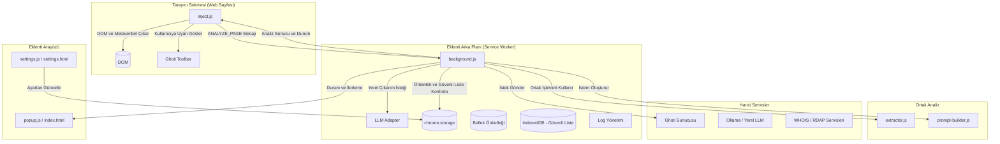

# Ghoti Extension

Ghoti, web sayfalarındaki phishing ve kötü amaçlı faaliyetleri tespit etmek amacıyla geliştirilmiş, yerel ve uzak LLM analizi kullanan bir tarayıcı eklentisidir. Eklenti [Manifest V3](https://developer.chrome.com/docs/extensions/develop/migrate/what-is-mv3) kullanmakta olup hem Chromium tabanlı tarayıcılarda hem de Firefox üzerinde kullanılabilmektedir.

Yerel modeller hem tarayıcı üzerinde WebGPU aracılığıyla hem de yerel Ollama istemcisi ile kullanılabilmektedir.

## Özellikler ve Mimari Yapı

### 1. Sayfa Analizi ve DOM Çıkarımı
Eklenti, kullanıcının ziyaret ettiği web sayfalarının DOM ağacını ve üst verilerini (metadata) incelemek için `inject.js` ve `shared/extractor.js` bileşenlerini kullanır:
* **DOM Sinyalleri**: Sayfadaki girdi alanları ve oltalama göstergeleri taranır.
* **Yapay Zeka Yorum Tespiti**: HTML kaynak kodunda LLM tarafından üretilmiş olabilecek yorum satırları, sayfa içerisindeki sahte gecikme ve sayaçlar tespit edilir.
* **Cloaking Tespiti**: `ETag` header'ları izlenerek, tarayıcıya sunulan içerik ile analiz edilen içerik arasındaki tutarsızlıklar denetlenir.

### 2. Hibrit Çıkarım Aşamaları (Yerel LLM ve ONNX Sınıflandırıcı)
Analiz süreci iki aşamalı bir yerel çıkarım süreci ve gerekmesi halinde merkezi model tarafından gerçekleşen kapsamlı analiz ile yürütülür:
* **Gerekçelendirme (Reasoning)**: Çıkarılan DOM sinyalleri kullanılarak `shared/prompt-builder.js` aracılığıyla bir teknik analiz istemi (prompt) oluşturulur. Yerel LLM (Web-LLM / WebGPU üzerinden) bu istemi işleyerek gerekçeli bir rapor hazırlar.
* **Puanlama ve Karar (Scoring & Verdict)**:
  * Dil modeli, oluşturduğu analizi yapılandırılmış bir JSON şemasına dönüştürür.
  * Oluşturulan analiz metni ayrı kriterlere ve ayrıştırılmış göstergelere göre sınıflandırılır.
  * Çıktı olarak 0-100 arasında bir risk puanı ve risk faktörleri listesi üretilir.

### 3. Durum ve Bellek Yönetimi
* **Önbellek (Caching)**: Aynı URL'lerin tekrar tekrar analiz edilmesini önlemek amacıyla oturum bazlı bellek önbelleği ile `chrome.storage.local` üzerinde tutulan bir LRU (Least Recently Used) cache sistemi kullanılır. Karar cache limiti 1000, detay cache limiti 200 adet kayıt ile sınırlandırılmıştır.
* **Güvenli Liste (Whitelist)**: IndexedDB veri tabanında tutulan güvenli alan adları listesi popüler sayfaların ve halihazırda taranmış adreslerin muaf tutulmasını sağlar.

---

## Mimari Bileşenler



### Klasör Yapısı ve Dosyalar

* `src/background.js`: Service Worker rolünü üstlenir. Eklentinin tarama kuyruğunu, önbellekleri, kimlik doğrulamayı ve mesajlaşma trafiğini yönetir.
* `src/inject.js`: Ziyaret edilen sayfalara enjekte edilen, DOM verisini toplayen ve toolbar'ı yöneten content script.
* `src/llm/`: Web-LLM (WebGPU) entegrasyonu, model yükleme ve state yönetimi kodlarını içerir.
* `config/`: Webpack yapılandırmalarını içerir.

---

## Kurulum ve Derleme

Eklentiyi yerel ortamda çalıştırmak ve derlemek için aşağıdaki adımları izleyin.

### Gereksinimler
* Node.js (v16 veya üzeri)
* npm

### Bağımlılıkların Yüklenmesi
```bash
npm install
```

### Development Modu
Değişikliklerin otomatik olarak build sürecinden geçmesi için
```bash
npm run watch
```

### Derleme Kodları
Farklı tarayıcı hedefleri için build komutları:

* **Firefox**:
  ```bash
  npm run build:firefox
  ```
  *(Varsayılan `npm run build` komutu da aynı işlevi görmektedir).*

* **Chromium tabanlı**:
  ```bash
  npm run build:chrome
  ```

